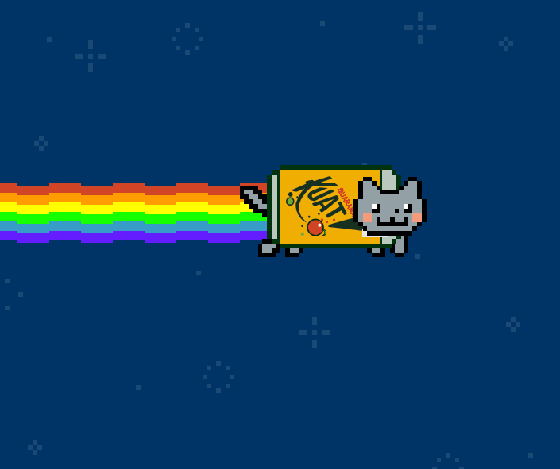
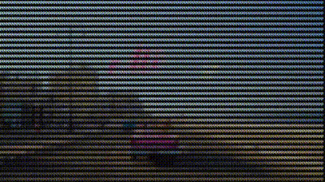

# Img2ColorfulChars
Convert an image or video to colorful chars and print them in C# console.

[中文 ReadMe](README.zh-CN.md)

## 1 / Principal
1. Colorful output: Since Windows 10 Anniversary Update, console can use characters parsed for VT100 and similar control character sequences that control cursor movement, color/font mode, and other operations that can also be performed via the existing Console APIs. (ref: [Console Virtual Terminal Sequences - Windows Console | Microsoft Docs](
https://docs.microsoft.com/en-us/windows/console/console-virtual-terminal-sequences))
2. Video processing: Convert video to images and output them in sequence.

## 2 / Requirements
- System requirement: Windows 10
- Format requirement:  
Image: .jpg, .jpeg, .png, .bmp, .ico, .tiff, **.gif**  
Video: .3gp, .asf, .avi, .flv, .m4v, .mov, .mp4, .mpg, .mpeg, .mkv, .rm, .rmvb, .wmv

## 3 / Usage
1. Get `Img2ColorfulChars.exe` in the following ways.
  - Clone this project and build in Visual Studio.
  - Or find it in [_Output](_Output).
  - Or find it in [Releases](https://github.com/Roy0309/Img2ColorfulChars/releases).
    
2. Run `Img2ColorfulChars.exe`.
  - Double click `Img2ColorfulChars.exe`. 
  - Select an image or video in the first window.
  - Set scale in the second window. (The autofit scale is given, which can be modified; larger scale gets smaller image.)
  - Enjoy the output!

## 4 / Output

### 1. Static image

### 2. GIF

### 3. Video
If the frame rate is too low, please increase the scale appropriately.  
 

## 5 / Summary(zh_CN)
- [来自多彩世界的控制台——C#控制台输出彩色字符 - 简书](https://www.jianshu.com/p/8a083421c11d)  
  Apply to Ver 1.1.